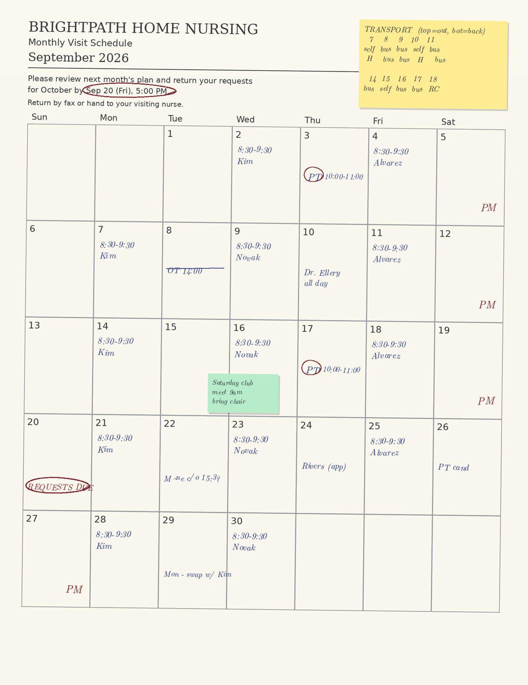

# Care Schedule Reader

**A Claude skill that reads a photo of a paper care schedule and gives you back structured records — with every uncertain reading flagged instead of guessed.**

[](LICENSE)

---

## Why this exists

My daughter has complex care needs. Her schedule lives on paper.

The home-nursing agency faxes a monthly roster. The day center sends its own printed grid. The respite unit works by application forms. And on our kitchen wall there is a calendar layered with sticky notes, maintained by hand, which is the only place all of it comes together.

Four organizations, four pieces of paper, and **no single view**. That is where the double-bookings come from. That is how a submission deadline gets missed and a month of requested care disappears.

I tried moving it all to a digital calendar. It didn't hold — the paper keeps arriving, and re-typing it every month is the kind of chore that quietly stops happening.

So I stopped trying to replace the paper and built something that reads it instead.

## What it does

Point Claude at a photo. You get back:

- **Deadlines first** — the single highest-consequence item on any agency roster, and the easiest to miss
- **One row per appointment**, with date, time, type, staff, and organization
- **A confidence tag on every row** — `Confirmed`, `Requested`, or `Uncertain`. Care schedules routinely carry granted and applied-for items in the same handwriting; conflating them creates appointments that do not exist
- **Transport arrangements** pulled out of the sticky-note block
- **A follow-up list** of everything it could not read cleanly

## What it refuses to do

This is the part that matters.

**It will not guess.** An illegible name comes back as `"reads as 'M-something'"` with a question attached, not as a confident wrong name. A wrong entry in a care schedule is worse than a missing one — a missing entry gets noticed, a wrong one gets trusted.

**It will not decide which day a sticky note belongs to.** Sticky notes shift. If a note sits between two dates, you get both candidates and a question.

**It will not treat color as meaningful** unless your legend says it is. The color may encode a category, or it may be the pad that was within reach.

**It will tell you when the date and the weekday disagree.** In the sample below, the cover note says the deadline is "Sep 20 (Fri)" — but Sep 20, 2026 is a Sunday. Catching that is worth the whole thing.

## See it work

<p align="center">
  
</p>

That fictional roster contains a strikethrough, two applied-for-but-not-granted entries, a deliberately smudged appointment, a weekday that does not match its date, and a sticky note straddling two cells.

**→ [What the skill returns](examples/sample-output.md)** — including the five things it asks you to confirm rather than assuming.

## Install

```
/plugin marketplace add azara43/care-schedule-reader
/plugin install care-schedule-reader@care-tools
```

Then drop a photo into Claude and say *"read this schedule."*

## Set up your legend

Every household and every agency uses its own shorthand. The skill reads yours from a legend file rather than assuming.

```bash
cp legend.example.md legend.md   # then edit it
```

Put `legend.md` in the folder where you keep your schedule photos, or at `~/.claude/care-legend.md`. It maps your abbreviations, symbols, staff names, and organizations to their meanings — see [`legend.example.md`](plugins/care-schedule-reader/skills/care-schedule-reader/legend.example.md) for the format.

**No legend?** The skill still reads the photo, then lists every symbol it did not recognize and offers to build the legend with you. It will not invent meanings.

## Things you can ask for

| Ask | You get |
|---|---|
| *"Read this schedule"* | Full structured output, ending with the follow-up list |
| *"Add these to my calendar"* | Confirmed rows only. Requested items get a `[REQUESTED]` prefix if you ask for them |
| *"What's happening today?"* | One screen: today's visits, transport, availability, deadlines within 3 days |
| *"What deadlines are coming up?"* | Every deadline across every sheet you have read, soonest first — the view no single piece of paper gives you |

## Privacy

Care schedules contain health information about someone who often cannot consent for themselves, plus the names of care staff.

- Nothing is transmitted externally without a human in the loop. The skill drafts; you send.
- It restricts drafted recipients to you and your household unless you have confirmed an organization accepts email. Many still work by fax only.
- It keeps health details out of filenames and calendar titles, which sync more widely than people expect.

**Redact names before sharing any real photo** — in a bug report, a screenshot, or anywhere else.

## Not a medical device

This reads handwriting. It gets things wrong, which is why every uncertain reading is flagged. **The paper is the source of truth.** Check the output against the paper before you rely on it. Do not use it to make clinical decisions.

## Contributing

If it misreads your paper, an issue with a **redacted** sample and the legend you were using is the most useful thing you can send. Different agencies use wildly different layouts and the skill improves by seeing more of them.

## License

MIT — see [LICENSE](LICENSE). Use it, change it, ship it. Keep the copyright notice, and understand it comes with no warranty.
